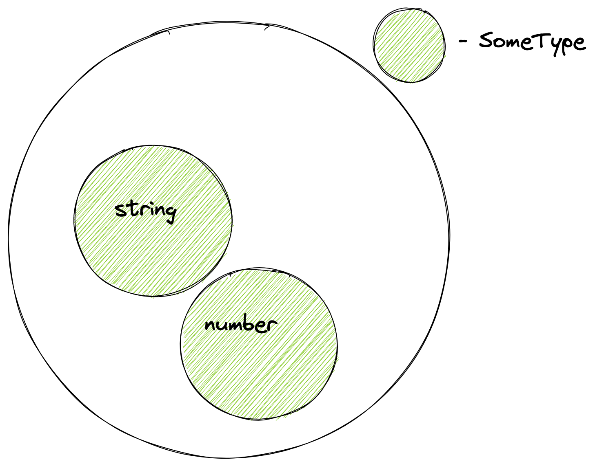

В этом уроке мы познакомимся с типами данных и узнаем, чем они полезны для разработчика. Также мы поговорим про типы как про множества. Это позволит понимать принципы работы TypeScript.

## Типы данных

Семейство языков, в котором нет типов данных, называется **ассемблером**. Эти языки работают напрямую с процессором и оперируют его регистрами. В регистрах хранятся значения, которые с точки зрения языка считаются числами, а что закодировано за этим числом, должен определять сам программист. Это может быть строка или часть картинки.

Главная проблема такого подхода — отсутствие безопасности. Программа не выдаст ошибку, если мы случайно сделаем что-то неправильное со строкой. С точки зрения процессора и языка программирования, строки нет — есть число, и мы выполняем над ним какие-то операции. В итоге программа работает всегда, но результат неверный. Нужен высокий уровень внимательности, чтобы программировать в таком режиме.

Ситуация исправилась, когда появились типы данных в высокоуровневых языках. Они позволили выполнить две задачи:

* описать и ограничить множество всех значений конкретного типа
* определить операции, которые возможно выполнить с этим типом

**Тип данных** — это множество всех значений и набор допустимых операций над ними. Так на код накладываются ограничения: числа складывают и вычитают, строки конкатенируют и ищут в них подстроку. Это обеспечивает **типобезопасность** и отсекает часть ошибок еще до запуска программы.

Даже в динамическом языке вроде JavaScript типы есть, и безопасность там выше, чем в ассемблере, где данные это просто последовательность бит. В статическом TypeScript ограничения на данные задаются точнее, поэтому и проверка строже.

## Множества

Если говорить про типы данных как про набор допустимых значений, то с одной стороны, это может быть ограничение числа по верхней и нижней границе. Например, так устроено в JavaScript. У нас есть `Number` для одного диапазона чисел и `BigInt` — для другого, когда нужно работать с огромными числами. С другой стороны, мы говорим про множества.

Взгляд на типы как на множества играет важную роль. Это связано с тем, что система типов языка TypeScript умеет комбинировать типы так, как это делается в обычных множествах. Например, мы можем объединить два множества типов и получить новый тип, в который входят все элементы первого множества и второго множества. Так появляется Union Type:

```typescript
type SomeType = number | string
const v1: SomeType = 1
const v2: SomeType = 'hexlet'
```



Примерно таким же способом можно построить пересечение и расширение типов и сделать другие действия с типами. Некоторые из них мы рассмотрим в курсе, но часть вещей останется за пределами. Главное — нужно перестроить свое мышление на операции с типами. Так будет проще понимать принципы работы TypeScript и запоминать определенное поведение.
