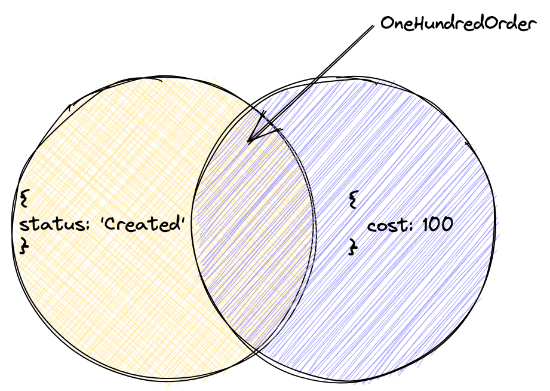

Вместе с объединением важной операцией в теории множеств является пересечение. Для разработчиков, которые привыкли к динамике JavaScript, эта операция может показаться менее значимой. Но без нее не обойтись, например, при описании типа слияния объектов.

Пересечение указывается с помощью символа `&`, по обе стороны от которого располагаются типы.

Определим тип объекта со статусом заказа, а затем более строгий тип с точной ценой:

```typescript
type Order = {
  status: 'Created',
}

type OneHundredOrder = Order & {
  cost: 100
}

const myOrder: OneHundredOrder = {
  status: 'Created',
  cost: 100
}
```

Из пересечения объектных типов с полями `status` **И** `cost` мы получили тип `OneHundredOrder`, который содержит оба этих поля.

Тип – это множество значений. Когда мы задаем пересечение типов, мы получаем новый тип, который содержит значения, подходящие под ограничения обоих типов.



Если мы объявим переменную `const StringAndNumber: string & number`, то ей нужно будет присвоить значение, которое одновременно принадлежит множествам `string` и `number`. То есть оно является одновременно и строкой, и числом. Такого значения не существует, поэтому `StringAndNumber` будет иметь тип `never`. `never` соответствует пустому множеству — тип, у которого нет ни одного значения.
