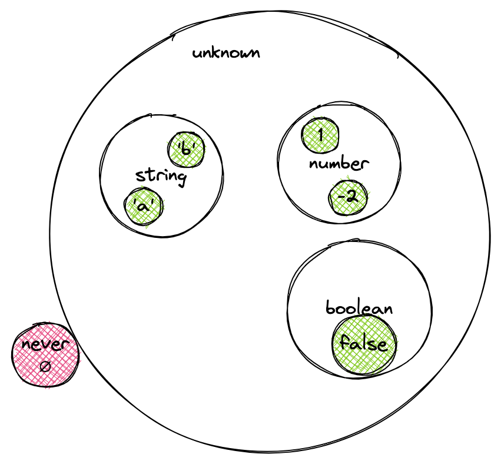

В этом уроке мы разберем связь между типами, которая выстраивается в иерархию.

## Типы как подмножества

Рассмотрим пример ошибки `Type X is not assignable to type Y` в функции для сортировки элементов. Допустим, у нас уже написана функция `sort`. И чтобы описать только ее типы, воспользуемся ключевым словом `declare`:

```typescript
type ComparatorCallback = (item1: number, item2: number, index: number) => -1 | 0 | 1
declare function sort(arr: Array<number>, callback: ComparatorCallback): Array<number>

const arr = [1, 2, 3];
const comparator = (item1: number, item2: number) => Math.sign(item1 - item2);

sort(arr, comparator) // Error: Type 'number' is not assignable to type '0 | 1 | -1'.
```

Проверка типов выдала ошибку: объединение литеральных типов `0 | 1 | -1` не совместимо с типом `number`. Можно подумать, что система типов ошибается, и стоит использовать `any`. Но если мы подумаем о литеральных числовых типах как о подмножествах `number`, все становится на свои места.

На этом примере мы снова можем увидеть связь типов с теорией множеств. Множество `A` является подмножеством `B`, если любой элемент, который принадлежит `A`, также принадлежит `B`. Так, с помощью операции объединения, мы получаем связи между типами, которые выстраиваются в иерархию вложенных множеств - иерархию типов.

## Литеральные типы

Напомним, что литеральные типы существуют для четырех типов данных: `boolean`, `string`, `number`, `BigInt`. В итоге любой литеральный тип можно присвоить переменной соответствующего типа:

```typescript
let num: number = 1;
const two: 2 = 2;
const notTrue: false = false;

num = two;
num = notTrue; // Type 'boolean' is not assignable to type 'number'.
```

Здесь `2` используется как литеральный тип, который представляет собой множество из одного элемента — двойки.

Анализатор успешно пропустил присваивание литерального типа числа к `number`, но литеральный `boolean` тип мы уже не смогли присвоить. Чтобы решить эту проблему, можно использовать объединение типов `number | boolean`. Но если мы не уверены, что может быть присвоено, нам пришлось бы делать объединение с потенциально огромным числом типов.

В этом случае нам на помощь приходит тип `unknown`.

## `unknown`

Тип `unknown` — это надмножество всех доступных типов. Он позволяет присвоить переменной значение произвольного типа:

```typescript
let unknownValue: unknown = 1;

unknownValue = 2; // OK
unknownValue = false; // OK
unknownValue = 'string'; // OK
```

Может показаться, что тип `unknown` работает так же, как `any`. Однако между ними есть принципиальное различие. Тип `any` отключает проверку типов и позволяет выполнять любые операции со значением, например, обращаться к свойствам переменной. Тип `unknown` запрещает это и требует предварительной проверки типа переменной, либо приведения к нужному типу. Давайте рассмотрим это на примере:

```typescript
let unknownValue: unknown;

unknownValue = 'string';
unknownValue.toUpperCase(); // Error: Property 'toUpperCase' does not exist on type 'unknown'.
```

Здесь мы смогли присвоить переменной `unknownValue` строку, но не можем вызвать метод `toUpperCase()`, потому что компилятор не знает, что в переменной находится строка. Для того чтобы вызвать метод, нужно сначала проверить тип переменной.

Другим важным свойством является то, что при объединении любых типов с `unknown` мы всегда получаем `unknown`:

```typescript
type UnionWithUnknown = unknown | number | boolean;
````

Такое поведение объясняется тем, что `unknown` — это надмножество всех типов, поэтому любое объединение с ним дает его само. Исключением тут является `any`, который и в этом случае отключает проверку типов и не подчиняется модели типов как множеств.

Далее разберем случай, когда мы хотим запретить присваивать переменной значения.

## `never`

Иногда на практике нужно быть уверенным, что переменной не будет присвоено никакого значения. Это можно реализовать с помощью типа `never`:

```typescript
let neverValue: never;
const two: 2 = 2;

neverValue = two; // Type 'number' is not assignable to type 'never'
```

В этом случае мы получили ошибку, потому что `never` — это пустое множество, которое не содержит ни одного элемента. Поэтому никакое значение не может быть присвоено переменной `neverValue`.

## Множества типов

Из текущих знаний мы можем составить следующую картинку множеств типов TypeScript:



В множество `number` также входят все объединения литеральных типов чисел, а в множество `string` — литеральных строк:

```typescript
type NumberUnion = -2 | -1 | 1 | 2

const one: NumberUnion = 1;
const num: number = one;

type StringUnion = 'a' | 'b' | 'c' | 'd'

const aChar: StringUnion = 'a';
const str: string = aChar;
```

Такое подмножество типов называют подтипом, а само множество супертипом.

Взаимосвязи подтипов и супертипов — ключевая концепция любого статически типизированного языка. Они образуют иерархию типов. Это становится особо важно, когда мы хотим привести один тип к другому.

## Приведение типов

Рассмотрим различные варианты приведения типов:

```typescript
let num = 1; // Неявное восходящее приведение
let one: number = 1; // Явное восходящее приведение

let two = num as 2; // Явное нисходящее приведение

let three = 3 as const; // Приведение к литеральному типу — нисходящее
```

Когда мы присваиваем значение в переменную или передаем аргументы в функцию, TypeScript пытается сделать восходящее приведение — от подтипа к базовому. Также можно явно задать восходящее приведение. Мы уже пользовались этой возможностью, чтобы проверить, возможно ли привести один тип к другому или указать явно, переменную какого типа мы ожидаем.

Приведение базового типа к подтипу делается явно с помощью ключевого слова `as`. При таком поведении TypeScript принимает приведение типов за истину. В некоторых случаях это может привести к ошибке. Поэтому нисходящее приведение считается небезопасным. К такому коду нужно пристально присмотреться.

Разберем еще один пример:

```typescript
const args = [8, 5]; // args: number[]
const angle = Math.atan2(...args); // error! A spread argument must either have a tuple type or be passed to a rest parameter.
console.log(angle);
```

Здесь компилятор определяет переменной `args` как тип `number[]` — массив с любым количеством числовых элементов. Компилятор расширил возможные значения в массиве, несмотря на то, что мы указали всего два элемента в массиве. Это и есть неявное восходящее приведение типа, когда компилятор приводит к более общему типу.

По этой причине возникает ошибка, потому что метод `Math.atan2()` ожидает два аргумента, а тип переменной `args` может содержать любое количество элементов. Исправим это с помощью ключевого слова `as`:

```typescript
const args = [8, 5] as const; // readonly [8, 5]
const angle = Math.atan2(...args); // okay
console.log(angle);
```

Теперь компилятор определяет тип для переменной `args` как литеральный тип `[8, 5]`. Хоть он и является множеством типа `number[]`, но это уже более строгий тип, который является массивом из двух конкретных чисел, поэтому ошибки не будет. Такое приведение называется "нисходящим", так как мы от более широкого типа приводим к более узкому типу, содержащему меньшее количество возможных значений.
